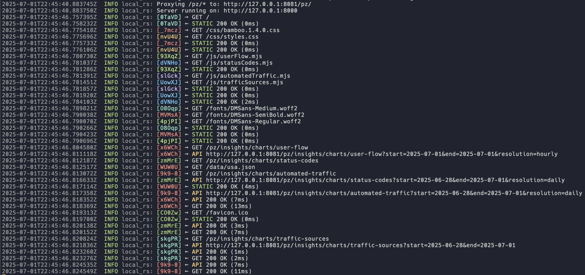

# local-rs

A Rust-based proxy server that serves static files and proxies API requests to a backend server. Built with Axum.

## Features

### 1. Static File Serving

- Serves static files from a specified directory (e.g., frontend build files)
- Automatically serves `index.html` for directory requests
- Properly sets Content-Type headers based on file extensions
- Supports all static assets (HTML, CSS, JS, images, etc.)

### 2. API Proxying

- Proxies requests to a backend API server
- Supports all HTTP methods (GET, POST, PUT, DELETE, etc.)
- Preserves request headers (except for hop-by-hop headers)
- Maintains query parameters
- Streams response body for efficient memory usage

### 3. Configuration

- Configurable via command line arguments:
  - `--static-dir`: Directory containing static files
  - `--api`: Backend API address (host:port or full URL)
  - `--api-path`: Path prefix for API requests (default: `/pz`)
  - `--bind`: Server bind address (default: `127.0.0.1:8000`)

### 4. Request Logging

- Detailed request/response logging including:
  - HTTP method and path
  - Response status codes
  - Request processing latency
  - API proxy latency (for proxied requests)

### 5. Robust Error Handling

- Proper error responses for:
  - Missing static files (404)
  - Failed API connections (502)
  - Internal server errors (500)

## Usage

### Installation

1. Ensure you have Rust installed (1.70+ recommended)
2. Clone this repository
3. Build with `cargo build --release`

### Running

Basic usage:

```bash
./proxy-server --static-dir dist/ --api 127.0.0.1:8081 --api-path /api
```


## Example Run

